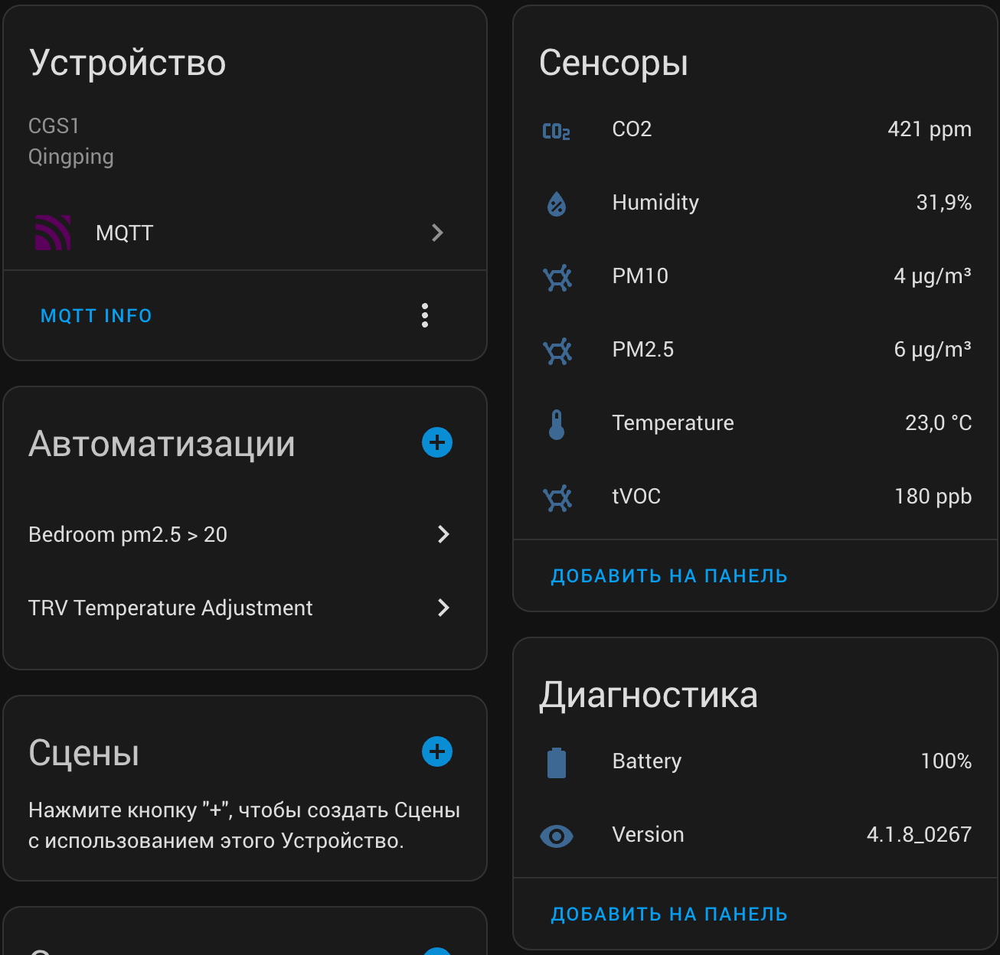

[![Telegram Chat][telegram-chat-shield]][telegram-chat]
[![Telegram Blog][telegram-blog-shield]][telegram-blog]
[![Support author][donate-tinkoff-shield]][donate-tinkoff]
[![Support author][donate-boosty-shield]][donate-boosty]

[telegram-chat-shield]: https://img.shields.io/static/v1?label=Обсуждение&message=Телеграм&logo=telegram&color=blue
[telegram-chat]: https://t.me/dentra_chat/3

[telegram-blog-shield]: https://img.shields.io/static/v1?label=Обновления+и+новости&message=Телеграм&logo=telegram&color=blue
[telegram-blog]: https://t.me/dentra_blog

[donate-tinkoff-shield]: https://img.shields.io/static/v1?label=Поддержать+автора&message=Тинькофф&color=yellow
[donate-tinkoff]: https://www.tinkoff.ru/cf/3dZPaLYDBAI

[donate-boosty-shield]: https://img.shields.io/static/v1?label=Поддержать+автора&message=Boosty&color=red
[donate-boosty]: https://boosty.to/dentra

# Локальный MQTT-доступ для устройств Qingping.

English version of this page is easily available via [google translate](https://dentra-github-io.translate.goog/qingping-mqtt/?_x_tr_sl=ru&_x_tr_tl=en&_x_tr_hl=ru&_x_tr_pto=wapp)

В статье будет рассмотрен монитор качества воздуха `Qingping Air Monitor` (`CGS1`/`cgllc.airmonitor.s1`). 
Порядок действий для `Qingping Air Monitor Lite` (`CGDN1`/`cgllc.airm.cgdn1`) будет похожим. 

После выполенния действий из этой статьи вы получтие вот такое устройство:

> Обратите внимание на присутсвующий сенсор батареи на последней версии прошивки (на 2023-11-03) 
> и абсольюно новый, более нигде не доступный, сенсор частиц `PM10`.




## Добавление устройсва в аккаунт "Qingping IoT"
* Идем в магазин приложений вашего телефона и устанавливаем приложение "Qingping IoT"
* Входим в аккаунт или если его нет регистрируемся
* Подключаем `Qingping Air Monitor` в "Qingping IoT"
  - На экране настроек `Qingping Air Monitor` выбираем подключение в "Qingping IoT"
  - В прилодении "Qingping IoT", добавить новое устройство и вводим код

## Включение MQTT
* Переходим на https://developer.qingping.co/ используя данные указанные при регистрации в приложении "Qingping IoT". 
(**Важно**: для доступа используйте ПК или планшет т.к. сайт не оптимизирован для мобильных устройств)
* Попадем на стартовую страницу и сразу переходим на вклдаку [Private Access Config](https://developer.qingping.co/privatisation/config)

### Добавление конфигурации брокера
* Удостоверямся, что находимся в разделе "Configurations"
* Используем кнопку справа вверху "+ Add Configuration"
* В открывшемся окне вводим:
  - Name: название вашей конфигурации, например "Air Monitor"
  - Device Model: выбираем модель вашего устройсва, например, "Qingping Air Monitor"
  - Private Type: выбираем "Self-built MQTT"
  - Self-built MQTT Information: нажимаем карандашик и заполняем параметры доступа к MQTT-брокеру: 
  "Host", "Port" и опционально "User Name" и "Password". Остальные параметры не трогаем и нажимаем "Confirm"
* Поддтвержаем сохранение кнопкой "Confirm".

### Добавление устройства и связывание с брокером
* Переходим в раздел "Devices"
* Используем кнопку справа вверху "+ Add Device"
* В появившемся окне выбираем модель вашего устройсва, например, "Qingping Air Monitor"
* Нажимаем кнопку "Next"
* Откроется новое окно со списком из одного или нескольких ваших устройств
* Выбираем устройство (если несколько, то ориентируясь по mac-адресу) и записываем куда-нибудь его mac-адрес, он нам потребуется далее.
* Нажимаем кнопку "Next"
* Выбираем созданную нами ранее конфигурацию и поддтвержаем сохранение кнопкой "Confirm".

### Применение изменений
Для того чтобы ваше устройство узнало о том что ему предоставили доступ к локальной очереди его необходимо перегрузить.

> Отдельной функции у `Qingping Air Monitor` для перезагрузки я не нашел, поэтому нажимая и удерживая кнопку сверху экрана попадаем в меню выключения и подтверждаем его. 
> Дождавшишь окончания процесса выключения, ждем еще 5 секунд и нажимаем с удерживанием ту же кнопку, включаем устройство.

> Из приложения "Qingping IoT" устройсво пропадет, это нормально.

## Просмотр содержимого очереди ([можно пропустить](#настройка-home-assistant))
* Берем MQTT Explorer и подключаемся к брокеру. 
* Вводим фильтр "qingping" и ждем.
* Нас интересует топик "qingping/582D3400BD48/up", где 582D3400BD48 - mac-адрес вашего устройсва в верхнем регистре.
* Если не изменять никакие параметры, то ожидание может занять до 15 минут до получения нужного сообщения.
* Мы будем получать сообщения двух типов (см. описание [3.17 Sensor Data Report](https://developer.qingping.co/main/private/public_mqtt#317-sensor-data-report)):
  - 12: данные реального времени
  - 17: исторические данные 
* Нас интерсуют данные 12 типа, вот их пример:

```json
{
    // mac-адрес устройства
    "mac": "582D3400BD48",
    // данные сенсоров
    // для типа 12, массив всегда состоит из одного элемента
    "sensorData": [
        {
            // данные состояния заряда батареи, еденица измерения "%"
            "battery": {
                // статус датчика: 1 - предположительно "от сети" или "заряжается"
                "status": 1, 
                // значение
                "value": 100
            },
            // данные датчика co2, еденица измерения "ppm"
            "co2": {"status": 0, "value": 428 },
            // данные датчика влажности, еденица измерения "%"
            "humidity": {"status": 0,"value": 31.700000762939453},
            // данные датчика PM 10, еденица измерения "µg/m³"
            "pm10": {
                // статус датчика, 0 - работает/OK, 3 - отключен
                "status": 0, 
                // при статусе 3, значение всегда равно 99999
                "value": 2
            },
            // данные датчика PM 2.5, еденица измерения "µg/m³"
            "pm25": {
                // статус датчика, 0 - работает/OK, 3 - отключен
                "status": 0, 
                // при статусе 3, значение всегда равно 99999
                "value": 3
            },
            // данные датчика температуры, еденица измерения "°C"
            "temperature": {"status": 0, "value": 22.799999237060547},
            // время измерения в формате unix timestamp
            "timestamp": {"value": 1699020350},
            // данные датчика tVOC, еденица измерения "ppb"
            "tvoc": {"status": 0, "value": 184}
        }
    ],
    // к сожалению не могу понять значение этого поля :(
    "third_state": 1,
    // время отправки данных в формате unix timestamp
    "timestamp": 1699020350,
    // тип данных пакета
    "type": "12",
    // версия програмного обеспечения
    "version": "4.1.8_0267"
}
```

Данные мы дождались, но снимать измерения раз в 15 минут как-то совсем грустно, поэтому обратимся к документации 
[3.12 Server Send Setting For Temporary Report And Duration Time](https://developer.qingping.co/main/private/public_mqtt#312-server-send-setting-for-temporary-report-and-duration-time)

```json
{
    // тип данных пакета
    "type" : "12",
    // запрашивать данные каждые 10 секунд
    "up_itvl" : "10",
    // длительность опросов 60 секунд
    "duration": "60" 
}
```

Итого нам надо послать json-пакет (без комментариев) в топик "qingping/582D3400BD48/down" (582D3400BD48 - mac-адрес вашего устройсва в верхнем регистре).
Теперь видим, что целую минуту мы начинаем получать репорты о состоянии сенсоров раз в 10 секунд. То что надо!

## Настройка Home Assistant

### Сенсоры

Все просто и банально, но к сожалению, только ручная конфигурация. Если вы используете простые пакеты, то приведенный ниже пример достаточно помесить в файл `packages/air_monitor.yaml`. Дальше вступает в силу поиск и замена.


- Поиск: "582D3400BD48", замена: mac-адрес вашего устройства в верхнем регистре.
- Поиск: "Bedroom Air Monitor", замена: "желаемое название вашего устройства", например: "Air Quality", можно испольовать любые символы. 
- Поиск: "bedroom_air_monitor", замена: "желаемое название вашего устройства", например: "air_quality", **ВАЖНО** испольовать только латинские мальнькие буквы, цифры и подчеркивание. 


<!--  --> 
```yaml
mqtt:
  sensor:
    - unique_id: bedroom_air_monitor_co2
      object_id: bedroom_air_monitor_co2
      name: "Bedroom Air Monitor CO2"
      # mac-address in topic name is case sensitive, use uppercase!
      state_topic: &bedroom_air_monitor_topic "qingping/582D3400BD48/up"
      device: &bedroom_air_monitor_device
        identifiers: [*bedroom_air_monitor_topic]
        name: "Bedroom Air Monitor"
        model: "CGS1" # use "CGDN1" for "Air Monitor Lite"
        manufacturer: "Qingping"
        # Unfortunally we can't use jinja2 template here, but if you want you can hardcode it
        # sw_version: "{{ value_json.version }}"
      device_class: carbon_dioxide
      state_class: measurement
      unit_of_measurement: "ppm"
      value_template: "{{ value_json.sensorData.0.co2.value if value_json.type == "12" and value_json.sensorData.0.temperature.status == 0 }}"

    - unique_id: bedroom_air_monitor_temperature
      object_id: bedroom_air_monitor_temperature
      name: "Bedroom Air Monitor Temperature"
      state_topic: *bedroom_air_monitor_topic
      device: *bedroom_air_monitor_device
      device_class: temperature
      state_class: measurement
      unit_of_measurement: "°C"
      value_template: "{{ value_json.sensorData.0.temperature.value | round(1) if value_json.type == "12" and value_json.sensorData.0.temperature.status == 0 }}"
      # suggested_display_precision: 1

    - unique_id: bedroom_air_monitor_humidity
      object_id: bedroom_air_monitor_humidity
      name: "Bedroom Air Monitor Humidity"
      state_topic: *bedroom_air_monitor_topic
      device: *bedroom_air_monitor_device
      device_class: humidity
      state_class: measurement
      unit_of_measurement: "%"
      value_template: "{{ value_json.sensorData.0.humidity.value | round(1) if value_json.type == "12" and value_json.sensorData.0.humidity.status == 0 }}"
      # suggested_display_precision: 1

    - unique_id: bedroom_air_monitor_tvoc
      object_id: bedroom_air_monitor_tvoc
      name: "Bedroom Air Monitor tVOC"
      state_topic: *bedroom_air_monitor_topic
      device: *bedroom_air_monitor_device
      device_class: volatile_organic_compounds_parts
      state_class: measurement
      unit_of_measurement: "ppb"
      # if you prefer "mg/m³" as unit of measurement instead of ppb
      # change device_class to volatile_organic_compounds,
      # unit_of_measurement above and apply to value_template below.
      # value_template: >-
      #   {{ (value_json.sensorData.0.tvoc.value * 12.187 * 110 / (273.15 + value_json.sensorData.0.temperature.value) / 1000) | round(3)
      #       if value_json.type == "12" and value_json.sensorData.0.tvoc.status == 0 }}
      value_template: "{{ value_json.sensorData.0.tvoc.value if value_json.type == "12" and value_json.sensorData.0.tvoc.status == 0 }}"

    - unique_id: bedroom_air_monitor_pm25
      object_id: bedroom_air_monitor_pm25
      name: "Bedroom Air Monitor PM2.5"
      state_topic: *bedroom_air_monitor_topic
      device: *bedroom_air_monitor_device
      device_class: pm25
      state_class: measurement
      unit_of_measurement: "µg/m³"
      value_template: "{{ value_json.sensorData.0.pm25.value if value_json.type == "12" and value_json.sensorData.0.pm25.status == 0 }}"

    - unique_id: bedroom_air_monitor_pm10
      object_id: bedroom_air_monitor_pm10
      name: "Bedroom Air Monitor PM10"
      state_topic: *bedroom_air_monitor_topic
      device: *bedroom_air_monitor_device
      device_class: pm10
      state_class: measurement
      unit_of_measurement: "µg/m³"
      value_template: "{{ value_json.sensorData.0.pm10.value if value_json.type == "12" and value_json.sensorData.0.pm25.status == 0 }}"

    - unique_id: bedroom_air_monitor_battery
      object_id: bedroom_air_monitor_battery
      name: "Bedroom Air Monitor Battery"
      state_topic: *bedroom_air_monitor_topic
      device: *bedroom_air_monitor_device
      device_class: battery
      state_class: measurement
      unit_of_measurement: "%"
      # do not additionally check status here
      value_template: "{{ value_json.sensorData.0.battery.value if value_json.type == "12" }}"
      entity_category: diagnostic

    # as we can't use jinja2 in device.sw_version,
    # so add addtional sensor to monitor version.
    # this sesnor is disabled by default.
    - unique_id: bedroom_air_monitor_version
      object_id: bedroom_air_monitor_version
      name: "Bedroom Air Monitor Version"
      state_topic: *bedroom_air_monitor_topic
      device: *bedroom_air_monitor_device
      value_template: "{{ value_json.version if value_json.type == "12" }}"
      entity_category: diagnostic
      enabled_by_default: false
```
<!--  --> 

### Настройка интервала обновления

Создайте новую пустую автоматизацию, переключитесь в текстовый режим и вставьте приведенное ниже содержимое.

Как минимум замените mac-адрес в топике на свой в верхнем регистре. Так же можно изменить интервал обновления.

<!--  --> 
```yaml
alias: Bedroom Air Monitor MQTT update interval
description: "Instruct Qingping Air Monitor to do updates more quickly"
trigger:
  - platform: time_pattern
    hours: /1
condition: []
action:
  - service: mqtt.publish
    data:
      qos: 0
      retain: false
      # change value of up_itvl to your interval in seconds
      payload: '{ "type": "12", "up_itvl": "10", "duration": "3600"}'
      # change 582D3400BD48 to your mac-address in uppercase
      topic: qingping/582D3400BD48/down
mode: single
```
<!--  --> 

## Открытые вопросы

Изначальное исследвание было нацелено на возможность автоматического отключения/включения мерзко жужащего вентилятора, 
такая возможноть на данный момент к сожалению отсутсвует. Но какие-то шансы на это есть, вот ответ поддержки Qinping:

> To enable turning on and turning off the PM sensor via MQTT, the firmware needs to support it. We will do this in the future, but the schedule is not fixed.

## Обсуждение/помощь/доработка

Обсудить и получить помощь можно в моем [чате в Telegram](https://t.me/dentra_chat/3)

Следить за моими проектами можно на моем [канале в Telegram](https://t.me/dentra_blog) или [ленте на Boosty](https://boosty.to/dentra).

## Ваша благодарность

Если эта статья оказалась для вас полезена и/или вы хотите поддержать дальнейшие исследования автора, то всегда можно оставить вашу благодарность [переводом на карту](https://www.tinkoff.ru/cf/3dZPaLYDBAI) или [подпиской](https://boosty.to/dentra) и обычной звездой существующим проектам.


